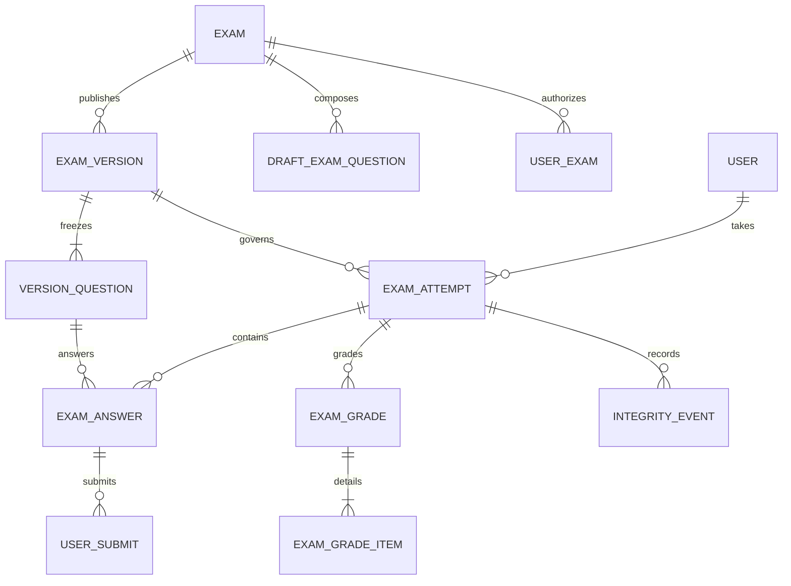

# Phase 1 Trusted Exam Domain Design

Status: Accepted for Phase 1 implementation  
Date: 2026-09-13  
Scope: Java programming exams only; the model keeps extension points for more question types and languages.

## 1. Goal

Phase 1 must provide one recoverable and auditable workflow:

`draft -> compose -> publish immutable version -> authorize candidates -> start/resume -> autosave -> submit/timeout -> grade -> release results`

The server is authoritative for time, attempt state, saved answer version, final submission, and score visibility. Browser state is a cache and must never decide a terminal outcome.

## 2. Domain boundaries

| Boundary | Owner | Responsibility |
| --- | --- | --- |
| Exam administration | `oj-system` | Draft editing, composition, publication, cancellation, candidate authorization, monitoring, result release |
| Candidate exam runtime | `oj-friend` | Access checks, attempt lifecycle, question navigation, autosave, heartbeat, submission, result visibility |
| Judging | `oj-judge` | Execute an immutable submission payload and publish a traceable result |
| Scheduling | `oj-job` | Reconcile exam lifecycle and finalize expired attempts idempotently |
| Browser applications | `frontend/apps/admin`, `frontend/apps/app` | Render server state, retain recoverable local drafts, and report integrity evidence |

Cross-service writes remain in the business database during Phase 1. Service methods own transactions; Redis is only a cache, lock, and transient delivery aid, never the source of truth.

## 3. Core invariants

1. Every published exam has exactly one immutable current version.
2. An attempt references one version forever; later question or draft edits cannot change it.
3. One candidate has at most one attempt for an exam version in Phase 1.
4. `started_at`, `deadline_at`, `submitted_at`, and `server_now` are generated by the server.
5. `deadline_at = min(started_at + duration, exam window end)`.
6. A terminal attempt cannot accept answer writes or new formal submissions.
7. An answer write only succeeds when its expected version equals the current version.
8. Every formal judge submission references an attempt, a question snapshot, and an answer version.
9. Start, final submit, timeout, publication, and result release are idempotent commands.
10. Scores are calculated from versioned question weights, not from the mutable question bank.
11. Integrity events are evidence. They create risk signals but never automatically determine cheating.
12. A database transaction commits state before caches and WebSocket notifications are updated.

## 4. Exam lifecycle

Persisted states use stable numeric codes for compatibility:

| Code | State | Meaning |
| --- | --- | --- |
| 0 | `DRAFT` | Editable and invisible to candidates |
| 1 | `PUBLISHED` | Immutable version exists; waiting for its start time |
| 2 | `ACTIVE` | Candidate start window is open |
| 3 | `FINISHED` | Exam window is closed and all attempts are terminal |
| 4 | `RESULT_RELEASED` | Candidate results are visible according to policy |
| 5 | `CANCELLED` | Administratively terminated; reason and actor are recorded |

Allowed transitions:

```text
DRAFT -> PUBLISHED
PUBLISHED -> DRAFT              only before start and before any attempt exists
PUBLISHED -> ACTIVE             at start_at
PUBLISHED -> CANCELLED
ACTIVE -> FINISHED              after window end and attempt finalization
ACTIVE -> CANCELLED
FINISHED -> RESULT_RELEASED
```

No transition leaves `RESULT_RELEASED` or `CANCELLED`. Corrective grading creates a new grade revision without reopening an attempt.

`ACTIVE` and `FINISHED` are persisted for monitoring, but every command also reconciles them against server time in its transaction. Correctness must not depend on a scheduler running at the exact boundary.

Publishing is atomic: validate the complete draft, insert the version and all question snapshots, point the exam to that version, and set `PUBLISHED` in one transaction. Re-publishing a withdrawn draft creates a new version number; an old version is never mutated or reused.

## 5. Attempt lifecycle

An authorized candidate has no attempt until the start command succeeds.

| Code | State | Writes allowed |
| --- | --- | --- |
| 0 | `IN_PROGRESS` | Autosave, run, and formal question submission |
| 1 | `SUBMITTED` | Judge completion and grade aggregation only |
| 2 | `TIMED_OUT` | Judge completion and grade aggregation only |
| 3 | `CANCELLED` | Administrative audit updates only |

Allowed transitions:

```text
(none) -> IN_PROGRESS           successful start
IN_PROGRESS -> SUBMITTED        candidate final submit
IN_PROGRESS -> TIMED_OUT        deadline reconciliation or timeout worker
IN_PROGRESS -> CANCELLED        exam cancellation or explicit administrator action
```

Start is allowed when the exam is `ACTIVE`, the candidate is authorized and enabled, the latest admission time has not passed, and no terminal attempt exists. A repeated start returns the same attempt. Refresh and reconnect call the resume query and receive the same deadline, question snapshots, latest saved answers, and server time.

Finalization freezes the latest persisted answer versions in the same transaction as the attempt transition. Pending judge jobs may finish afterwards, but they cannot change the frozen source or reopen the attempt.

## 6. Time model

- API timestamps use ISO 8601 UTC instants such as `2026-09-13T09:00:00Z`.
- New database timestamps use `DATETIME(3)` and are stored in UTC.
- User-facing pages convert timestamps to the configured display zone, initially `Asia/Shanghai`.
- Services use an injected `Clock`; business code does not call `LocalDateTime.now()` directly.
- The start/resume/heartbeat responses include `serverNow`, `deadlineAt`, and terminal state.
- The browser calculates display countdown from `deadlineAt - serverNow`, re-synchronizes on heartbeat, and treats a local zero only as a request to refresh server state.
- Every mutating command locks or conditionally updates the attempt and checks `database/server now >= deadline_at` before accepting a write.

The global exam window has `start_at`, `latest_start_at`, and `end_at`. `duration_minutes` controls an individual attempt, while `end_at` is the hard upper bound for everyone.

## 7. Data model

Existing table names retain the `tb_` prefix and Snowflake-style `bigint unsigned` identifiers.

### 7.1 Existing tables to extend

`tb_exam`

- Keep `exam_id`, title, creator, and audit fields as the mutable aggregate root.
- Reinterpret `status` using the lifecycle codes above; existing `0/1` rows remain compatible.
- Add `current_version_id`, `version_no`, `cancel_reason`, `published_at`, `finished_at`, and `result_released_at`.
- Draft rules may live on this table for editing, but runtime reads must use the published version.

`tb_exam_question`

- Remains the draft composition table.
- Add `score`, `required`, and a future-compatible `question_type`.
- Add unique `(exam_id, question_id)` and `(exam_id, question_order)` constraints.
- Published runtime code never reads this table.

`tb_user_exam`

- Remains candidate authorization during migration.
- Add unique `(exam_id, user_id)`, authorization status, source, and revocation metadata.
- Existing `score` and `exam_rank` become compatibility projections until all readers use grade tables.

`tb_user_submit`

- Add nullable `attempt_id`, `version_question_id`, `answer_id`, `answer_version`, and `submit_kind` (`RUN` or `FORMAL`).
- Preserve unique `request_id`; it is the judge command idempotency key.
- New exam submissions must populate all traceability columns.
- Practice submissions keep these columns nullable.

### 7.2 New immutable publication tables

`tb_exam_version`

| Field group | Required content |
| --- | --- |
| Identity | `version_id`, `exam_id`, monotonically increasing `version_no` |
| Schedule | `start_at`, `latest_start_at`, `end_at`, `duration_minutes`, display timezone |
| Policy | submission limits, feedback visibility, result release policy, instructions |
| Integrity | integrity policy JSON, version content hash |
| Audit | publisher and `published_at` |

Constraints: unique `(exam_id, version_no)` and unique content hash within an exam. There is no update operation after insert.

`tb_exam_version_question`

| Field group | Required content |
| --- | --- |
| Identity | `version_question_id`, `version_id`, source `question_id`, order |
| Scoring | score, required flag, question type |
| Statement snapshot | title, content, input/output description, examples and attachments manifest |
| Judge snapshot | time/memory limits, cases or immutable case-set reference, judge mode/configuration |
| Language snapshot | allowed language codes, starter code and entry template JSON |
| Integrity | source update time and SHA-256 snapshot hash |

Constraints: unique `(version_id, question_order)` and `(version_id, question_id)`. Runtime DTOs must not expose hidden cases or judge-only configuration.

### 7.3 New runtime tables

`tb_exam_attempt`

- Identity: `attempt_id`, `exam_id`, `version_id`, `user_id`.
- State: attempt status and an optimistic `row_version`.
- Time: `started_at`, `deadline_at`, `last_active_at`, `submitted_at`, `finalized_at`.
- Context: first IP hash, latest IP hash, user-agent hash, current session id.
- Finalization: finalization reason and idempotency key.
- Constraint: unique `(version_id, user_id)`.
- Query indexes: `(exam_id, status)`, `(status, deadline_at)`, `(user_id, status)`.

`tb_exam_answer`

- Identity: `answer_id`, `attempt_id`, `version_question_id`.
- Content: answer type, language code, code/text/structured answer payload.
- Versioning: integer `answer_version`, content hash, saved time, frozen time.
- Judge pointers: latest formal `submit_id` and latest accepted `submit_id`.
- Constraint: unique `(attempt_id, version_question_id)`.

Large or future structured answers use JSON only behind a typed application contract. Java code remains in `LONGTEXT`; it is not embedded in audit log messages.

`tb_exam_grade`

- One grade header per attempt and revision: total score, status, calculation source, revision, released time, and audit fields.
- Unique `(attempt_id, revision)`; one pointer or flag identifies the current revision.

`tb_exam_grade_item`

- One item per grade and version question: awarded score, maximum score, source submit, grading mode, and adjustment reason.
- Unique `(grade_id, version_question_id)`.

`tb_integrity_event`

- Append-only event with `attempt_id`, session id, monotonically increasing client sequence, event type, client observation time, server receipt time, and minimal metadata JSON.
- Unique `(attempt_id, session_id, client_sequence)` makes retries idempotent.
- Index `(attempt_id, server_received_at)` supports the evidence timeline.
- Clipboard contents, keystrokes, and raw screen content are not stored in Phase 1.

`tb_exam_command`

- Records high-value idempotent commands: publish, start, final submit, cancel, and release results.
- Unique `(command_type, actor_id, idempotency_key)`.
- Stores target id, request hash, result reference, status, and timestamps.
- Reusing a key with a different request hash returns an idempotency conflict.

## 8. Entity relationships



## 9. Command idempotency and concurrency

| Command | Idempotency rule | Concurrency rule |
| --- | --- | --- |
| Publish | Required key plus unique exam/version number | Lock exam row; create version and snapshots in one transaction |
| Start | Required key; unique candidate/version is the final guard | Lock authorization/exam or use insert-on-unique-conflict then return existing attempt |
| Autosave | `(answer_id, expectedVersion)` | Conditional update increments `answer_version`; stale writes return current version and hash |
| Run/formal submit | Client request id becomes unique `request_id` | Insert submission before dispatch; retries return the same submission state |
| Final submit | Required key stored on attempt/command | Conditional transition from `IN_PROGRESS`; repeat returns terminal representation |
| Timeout | Deterministic key `timeout:{attemptId}:{deadlineAt}` | Conditional transition from `IN_PROGRESS`; workers may retry freely |
| Release results | Required key plus current grade revision | Lock exam; verify all required grades are ready before transition |

The outbox pattern is required when a committed database state must trigger RabbitMQ, cache invalidation, or WebSocket delivery. Phase 1 may first reuse the current reliable judge dispatch path, but no new transaction may rely on a best-effort publish after commit without a replay mechanism.

## 10. Main flows

### Publish

1. Lock the exam and verify `DRAFT`.
2. Validate schedule, total score, question order, question availability, judge cases, and allowed languages.
3. Copy all runtime fields into a new version and question snapshots.
4. Compute content hashes and store the version number.
5. Set the exam current version and `PUBLISHED` state.
6. Commit, then invalidate caches and emit an audit event.

### Start or resume

1. Reconcile lifecycle using server time and load candidate authorization.
2. Reject with a stable reason if early, late, unauthorized, disabled, cancelled, or already terminal.
3. Create the attempt and fixed deadline atomically, or return the existing attempt on retry.
4. Return sanitized snapshots, persisted answers, attempt state, `serverNow`, and `deadlineAt`.

### Save and submit a question

1. Reconcile deadline and terminal state.
2. Save with expected answer version; return conflict details for stale writes.
3. For a formal submission, freeze the referenced answer version into `tb_user_submit`.
4. Commit submission state before RabbitMQ dispatch.
5. Apply judge results only to the matching `request_id`; push updates after persistence.

### Final submit or timeout

1. Lock/conditionally update the attempt if it is still `IN_PROGRESS`.
2. Freeze all current answer versions and set the terminal server timestamp.
3. Mark missing required answers explicitly; do not synthesize browser data.
4. Queue pending score aggregation and return the terminal representation.
5. Retry aggregation until all submissions reach a judge terminal state or an administrator resolves failures.

## 11. Authorization and audit

- Administration endpoints require explicit exam-management permissions, not only a valid token.
- Candidate endpoints derive `user_id` from the authenticated server context; request bodies cannot select another candidate.
- Every query for attempt, answer, submission, grade, and integrity data scopes by owner or administrative permission.
- Publish, withdraw, cancel, start, save conflict, formal submit, final submit, timeout, rejudge, grade adjustment, and result release are auditable.
- Audit records contain actor, action, target, server time, request/correlation id, and result. They exclude answer source, hidden cases, tokens, clipboard contents, and secrets.
- Integrity evidence has a documented retention period and restricted access before production use.

## 12. Migration and compatibility

1. Add new columns and tables without dropping or renaming existing columns.
2. Preserve `tb_exam.status` values `0` and `1`; add new codes in application enums.
3. Backfill one version for existing published exams in the test environment only after validating every question can be snapshotted.
4. Keep legacy exam reads during a short compatibility window, but route all newly published exams through versions.
5. Dual-write result summaries to `tb_user_exam.score/exam_rank` until rank readers migrate to grade tables.
6. Keep practice submissions valid by allowing new exam traceability columns on `tb_user_submit` to be null.
7. Add foreign keys only after cleaning current data and measuring operational impact; unique constraints and application checks are mandatory from the first migration.
8. Each migration has a forward script, verification queries, compatibility notes, and a rollback script. Rollback disables new writes before removing structures and never discards captured attempts or answers.

## 13. Phase 1 non-goals

- Browser lockdown, camera recording, face recognition, or automatic cheating verdicts.
- Multiple attempts per candidate, team exams, adaptive exams, or offline exams.
- New judge languages or non-programming question execution.
- Full event sourcing or replacing the current microservice layout.
- Showing hidden judge cases to candidates.

## 14. Implementation order

1. Establish migration conventions and create additive schema migrations.
2. Add shared enums, injected clock, transition validators, and repository tests.
3. Implement atomic publication and snapshot reads.
4. Implement start/resume, heartbeat, versioned autosave, and terminal finalization.
5. Link judge submissions to immutable answer versions and aggregate grades.
6. Build admin composition/monitoring and candidate exam workspace.
7. Add integrity evidence, E2E coverage, test deployment, and production release controls.

This document is the Phase 1 domain contract. Changes to invariants, terminal states, time authority, or immutable publication rules require an explicit design update before implementation.
